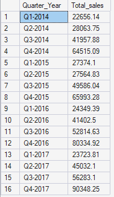
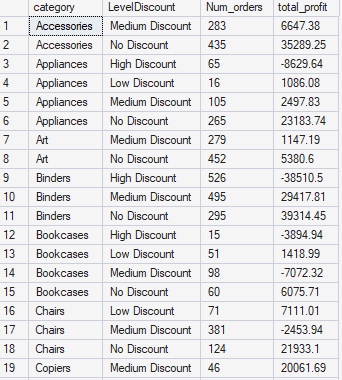
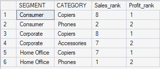
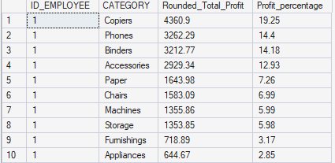
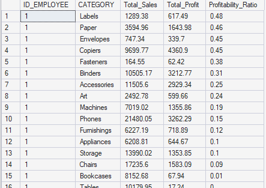
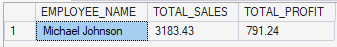
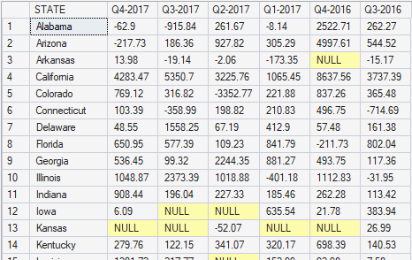

# Sales SQL - Exploratory Data Analysis

This repository contains SQL scripts and sample data used to explore sales data and answer a set of analysis questions.

## Contents
- `answer.sql`: SQL queries and answers for the analysis.
- `CUSTOMER.csv`, `EMPLOYEES.csv`, `ORDERS.csv`, `PRODUCT.csv`: Sample data files.

## Dataset description
- `CUSTOMER.csv`: Customer master data (segment, location, region).
- `EMPLOYEES.csv`: Employee list with city and region.
- `PRODUCT.csv`: Product catalog with category and subcategory.
- `ORDERS.csv`: Transaction-level orders with dates, product, sales, profit, and employee.

## How to use
1. Import the CSV files into your SQL database.
2. Run the queries in `answer.sql` against the imported tables.

## Schema
- `CUSTOMER` (`ID`, `NAME`, `SEGMENT`, `COUNTRY`, `CITY`, `STATE`, `POSTAL_CODE`, `REGION`)
- `EMPLOYEES` (`ID_EMPLOYEE`, `NAME`, `CITY`, `REGION`)
- `PRODUCT` (`ID`, `NAME`, `CATEGORY`, `SUBCATEGORY`)
- `ORDERS` (`ROW_ID`, `ORDER_ID`, `ORDER_DATE`, `SHIP_DATE`, `SHIP_MODE`, `CUSTOMER_ID`, `PRODUCT_ID`, `SALES`, `QUANTITY`, `DISCOUNT`, `PROFIT`, `ID_EMPLOYEE`)

## Results
### Question 1
Write an SQL query to calculate the total sales of furniture products, grouped by each quarter of the year, and order the results chronologically.

### Question 2
Analyze the impact of different discount levels on sales performance across product categories, specifically looking at the number of orders and total profit generated for each discount classification.

Discount level condition:
- No Discount = 0
- 0 < Low Discount <= 0.2
- 0.2 < Medium Discount <= 0.5
- High Discount > 0.5

### Question 3
Determine the top-performing product categories within each customer segment based on sales and profit, focusing specifically on those categories that rank within the top two for profitability.

### Question 4
Create a report that displays each employee's performance across different product categories, showing not only the total profit per category but also what percentage of their total profit each category represents, with the result ordered by the percentage in descending order for each employee.

### Question 5
Develop a user-defined function in SQL Server to calculate the profitability ratio for each product category an employee has sold, and then apply this function to generate a report that sorts each employee's product categories by their profitability ratio.

### Question 6
Write a stored procedure to calculate the total sales and profit for a specific EMPLOYEE_ID over a specified date range. The procedure should accept EMPLOYEE_ID, StartDate, and EndDate as parameters.

### Question 7
Write a query using dynamic SQL query to calculate the total profit for the last six quarters in the datasets, pivoted by quarter of the year, for each state.

## Notes
- The queries are written for SQL Server, but can be adapted to other SQL engines.
