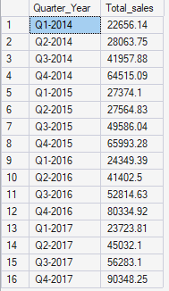
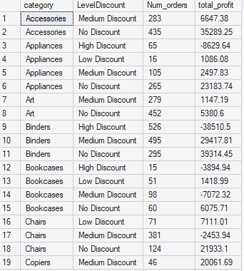
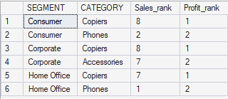
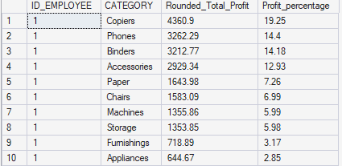
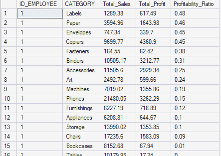
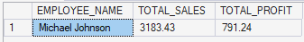
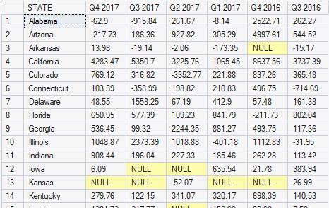

## Sales SQL - Exploratory Data Analysis

This repository contains SQL scripts and sample data used to explore sales performance and answer a set of business-driven analysis questions.

### Business problem statement
The goal of this project is to help a retail company understand **how products, customers, employees, discounts, and regions contribute to overall sales and profitability**.  
By analyzing historical orders, the business wants to:
- Identify growth opportunities by product category and customer segment.
- Understand which discount strategies improve revenue without destroying profit.
- Evaluate employee and regional performance to improve sales allocation and targeting.

### Business questions
This analysis is designed to answer the following core business questions:
1. **Sales seasonality**: How do furniture sales evolve by quarter? Are there peak or low seasons the business should plan for?
2. **Discount effectiveness**: How do different discount levels affect the number of orders, sales, and profit across product categories?
3. **High-value categories by segment**: For each customer segment, which product categories contribute the most to sales and profit (top 2 by profitability)?
4. **Employee performance mix**: For each employee, which product categories generate the most profit and what share of their total profit does each category represent?
5. **Category profitability ratio**: For each employee and product category, how profitable are sales relative to revenue (profitability ratio), and which categories should they focus on?
6. **Employee performance over time**: For a given employee and time period, what are their total sales and profit?
7. **Regional profit trends**: Over the last six quarters, how does profit evolve by state, and which states are improving or declining?

These questions are implemented as SQL queries, a user-defined function, and a stored procedure in `answer.sql`.

## Contents
- `answer.sql`: SQL queries, user-defined function, and stored procedure that answer the analysis questions.
- `CUSTOMER.csv`, `EMPLOYEES.csv`, `ORDERS.csv`, `PRODUCT.csv`: Sample data files.
- `screenshots/`: Example result screenshots for each question.

## Dataset description
- `CUSTOMER.csv`: Customer master data (segment, location, region).
- `EMPLOYEES.csv`: Employee list with city and region.
- `PRODUCT.csv`: Product catalog with category and subcategory.
- `ORDERS.csv`: Transaction-level orders with dates, product, sales, profit, and employee.

## Schema
- `CUSTOMER` (`ID`, `NAME`, `SEGMENT`, `COUNTRY`, `CITY`, `STATE`, `POSTAL_CODE`, `REGION`)
- `EMPLOYEES` (`ID_EMPLOYEE`, `NAME`, `CITY`, `REGION`)
- `PRODUCT` (`ID`, `NAME`, `CATEGORY`, `SUBCATEGORY`)
- `ORDERS` (`ROW_ID`, `ORDER_ID`, `ORDER_DATE`, `SHIP_DATE`, `SHIP_MODE`, `CUSTOMER_ID`, `PRODUCT_ID`, `SALES`, `QUANTITY`, `DISCOUNT`, `PROFIT`, `ID_EMPLOYEE`)

## Results
### Question 1
Write an SQL query to calculate the total sales of furniture products, grouped by each quarter of the year, and order the results chronologically.

### Question 2
Analyze the impact of different discount levels on sales performance across product categories, specifically looking at the number of orders and total profit generated for each discount classification.

Discount level condition:
- No Discount = 0
- 0 < Low Discount <= 0.2
- 0.2 < Medium Discount <= 0.5
- High Discount > 0.5

### Question 3
Determine the top-performing product categories within each customer segment based on sales and profit, focusing specifically on those categories that rank within the top two for profitability.

### Question 4
Create a report that displays each employee's performance across different product categories, showing not only the total profit per category but also what percentage of their total profit each category represents, with the result ordered by the percentage in descending order for each employee.

### Question 5
Develop a user-defined function in SQL Server to calculate the profitability ratio for each product category an employee has sold, and then apply this function to generate a report that sorts each employee's product categories by their profitability ratio.

### Question 6
Write a stored procedure to calculate the total sales and profit for a specific EMPLOYEE_ID over a specified date range. The procedure should accept EMPLOYEE_ID, StartDate, and EndDate as parameters.

### Question 7
Write a query using dynamic SQL query to calculate the total profit for the last six quarters in the datasets, pivoted by quarter of the year, for each state.

## Insights and recommendations

### Key insights (typical patterns)
- **Furniture sales seasonality**: Furniture sales clearly peak in Q4 and are weakest in Q1, so year‑end quarters require more inventory and marketing focus.
- **Discount effectiveness**: 
  - Low to medium discounts increase order volume while still preserving profit.
  - Very high discounts often flip profit to negative in some categories despite a large number of orders, so deep discounting needs to be tightly controlled.
- **High-value segments and categories**:
  - Across segments, a small set of categories consistently ranks in the top positions for both sales and profit.
  - Focusing on the top 1–2 categories per segment usually captures the majority of profit contribution while keeping the product portfolio manageable.
- **Employee specialization**:
  - Some employees generate most of their profit from a few key categories, while other categories contribute only a small share.
  - Their profit mix indicates where individual salespeople are strongest and where targeted training or reassignment could improve overall performance.
- **Regional trends**:
  - Profitability is concentrated in a subset of states that show consistently positive profit over the last six quarters, while a few states have repeated negative or missing values.
  - Trend analysis across the last six quarters highlights which regions are improving and which may be destroying value and require corrective actions.

### Recommended actions
- **Optimize discount strategy**:
  - Restrict very high discounts in categories where they are consistently unprofitable.
  - Encourage low/medium discounts in categories where they demonstrably increase volume without destroying margin, and monitor the profit impact by category over time.
- **Focus on winning segment–category combinations**:
  - Prioritize marketing and sales efforts on the top‑ranked categories for each high‑value segment, especially where both sales and profit ranks are high.
  - Develop bundles, cross‑sell offers and targeted campaigns around these segment–category pairs to deepen penetration without broad discounting.
- **Support and replicate top-performing employees**:
  - Use the profitability ratio and profit‑mix reports to identify employees with strong performance in key categories, then document and share their playbooks.
  - For employees skewed toward low‑margin categories, gradually rebalance their portfolio toward higher‑margin products and provide coaching on discount discipline.
- **Allocate resources by region**:
  - Invest more in regions/states that show consistently positive and growing profit, prioritizing inventory, marketing budget and stronger sales coverage there.
  - For underperforming regions with repeated negative quarters, review pricing, discount levels, logistics costs and local competition before deciding whether to fix, refocus or exit.

## Notes
- The queries are written for SQL Server, but can be adapted to other SQL engines.
